# Interview Orchestration - Planning Document

> Based on Upwage Turn-by-Turn Overview (Dec 2, 2025) + Wireframe

## Business Context

Moving from a monolithic screener prompt to **turn-by-turn architecture** for:
- More control over interview flow
- Easier updates and maintenance
- Compatibility with multiple interview types
- Reduced errors and QA time

---

## Core Requirements

| Requirement | Description |
|-------------|-------------|
| **Flexible Questions** | Any number, any type, any order |
| **Basic vs Assessment** | Determined by `max_followups` - basic (0) gets canned responses |
| **Response Categorization** | Classify responses before generating reply |
| **EEOC/Scope Check** | Detect concerns, outside scope, reportable incidents |
| **Translation** | Translate non-English responses; store both original + translated |
| **Max Follow-ups** | Per-question limit on follow-up depth |
| **LLM Fallback** | Administer interviews without LLM (verbatim questions) |
| **Empathetic Responses** | Always acknowledge before next question (assessment) |

---

## Input Schema

```typescript
type InterviewType = "screener" | "exit";

type QuestionType = 
  | "number_scale"
  | "long_answer"
  | "short_answer"
  | "yes_no"
  | "single_select"
  | "phone_number";

interface Question {
  type: QuestionType;
  text: string;
  max_followups: number;  // 0 = basic question, >0 = assessment question
  group?: string;
  options?: string[];     // Required for single_select
}

interface InterviewConfig {
  interview_type: InterviewType;
  questions: Question[];
  llm_fallback?: boolean;
}
```

---

## Basic vs Assessment Classification

**Determined by `max_followups`:**

| max_followups | Classification | Handling |
|---------------|----------------|----------|
| `0` | **Basic** | Validate format → Store → Canned ack → Next |
| `≥1` | **Assessment** | Full LLM analysis (concerns, proper response, follow-ups) |

This allows any question type to be either basic or assessment:
- `short_answer` with `max_followups: 0` → Basic (e.g., "What city do you live in?")
- `short_answer` with `max_followups: 2` → Assessment (e.g., "Describe your biggest challenge")

---

## Response Processing Flow

```mermaid
flowchart TD
    classDef start fill:#1a1a2e,stroke:#e94560,stroke-width:2px,color:#fff
    classDef process fill:#16213e,stroke:#0f3460,stroke-width:2px,color:#fff
    classDef llm fill:#533483,stroke:#e94560,stroke-width:2px,color:#fff
    classDef decision fill:#0f3460,stroke:#00d9ff,stroke-width:2px,color:#fff
    classDef store fill:#2d4a3e,stroke:#00ff88,stroke-width:2px,color:#fff
    classDef output fill:#4a3728,stroke:#ffa500,stroke-width:2px,color:#fff

    evaluate["📥 Evaluate
    Interview Response"]:::start

    translate["🌐 Translate to English
    (if needed)
    ─────────────
    Store both original
    + translated"]:::llm

    isBasic{{"max_followups
    === 0?"}}:::decision

    storeBasic["💾 Store response
    +
    Canned acknowledgement"]:::store

    checkConcerns["🔍 LLM
    Check for Concerns
    ─────────────
    • EEOC issues
    • Outside scope
    • Incidents"]:::llm

    hasConcerns{{"Concerns
    detected?"}}:::decision

    respondConcerns["⚠️ Respond
    Accordingly"]:::output

    checkProper["🔍 LLM
    Was it a proper response?
    Or more context needed?"]:::llm

    isProper{{"Proper
    response?"}}:::decision

    moreFollowups{{"followupCount
    < max_followups?"}}:::decision

    empathyFollowup["💬 LLM
    Empathetic Response
    +
    Ask followup"]:::llm

    empathyOnly["💬 LLM
    Empathetic Response"]:::llm

    nextOrEnd["➡️ Next Question
    or
    Conclusion"]:::output

    %% Flow
    evaluate --> translate
    translate --> isBasic

    isBasic -->|"Yes (Basic)"| storeBasic
    storeBasic --> nextOrEnd

    isBasic -->|"No (Assessment)"| checkConcerns

    checkConcerns --> hasConcerns
    hasConcerns -->|"Yes"| respondConcerns
    respondConcerns --> nextOrEnd

    hasConcerns -->|"No"| checkProper

    checkProper --> isProper
    isProper -->|"No"| moreFollowups

    moreFollowups -->|"Yes"| empathyFollowup
    empathyFollowup -.->|"Wait for response"| evaluate

    moreFollowups -->|"No"| empathyOnly
    empathyOnly --> nextOrEnd

    isProper -->|"Yes"| empathyOnly
```



---

## State Schema

```typescript
// ─────────────────────────────────────────────────────────────────────────────
// Response Categories (from LLM analysis)
// ─────────────────────────────────────────────────────────────────────────────
interface ResponseCategories {
  hasConcerns: boolean;
  concernType?: "eeoc" | "outside_scope" | "incident" | null;
  concernDetails?: string;
  isProperResponse: boolean;
  needsMoreContext: boolean;
}

// ─────────────────────────────────────────────────────────────────────────────
// Collected Data
// ─────────────────────────────────────────────────────────────────────────────
interface FollowupExchange {
  question: string;
  answer: string;
  translatedAnswer?: string;
}

interface QuestionResponse {
  questionIndex: number;
  questionText: string;
  questionType: QuestionType;
  group?: string;
  
  // Answers - store both original and translated
  rawAnswer: string;
  translatedAnswer?: string;  // Only if translation was needed
  wasTranslated: boolean;
  
  // Metadata
  wasSkipped: boolean;
  hadConcerns: boolean;
  concernType?: string;
  followups: FollowupExchange[];
}

// ─────────────────────────────────────────────────────────────────────────────
// Main State
// ─────────────────────────────────────────────────────────────────────────────
interface InterviewState {
  // Configuration (immutable after init)
  interviewType: InterviewType;
  questions: Question[];
  llmFallback: boolean;
  
  // Progress
  currentQuestionIndex: number;
  currentFollowupCount: number;
  
  // Current turn
  rawResponse: string | null;         // Original response
  translatedResponse: string | null;  // Translated (if needed)
  wasTranslated: boolean;
  categories: ResponseCategories | null;
  
  // Validation
  needsReprompt: boolean;
  repromptReason: string | null;
  
  // Collected data
  responses: QuestionResponse[];
  
  // Conversation
  messages: BaseMessage[];
  
  // Completion
  isComplete: boolean;
}
```

---

## Full Graph Architecture

```mermaid
flowchart TD
    classDef startEnd fill:#1a1a2e,stroke:#e94560,stroke-width:2px,color:#fff
    classDef process fill:#16213e,stroke:#0f3460,stroke-width:2px,color:#fff
    classDef llm fill:#533483,stroke:#e94560,stroke-width:2px,color:#fff
    classDef decision fill:#0f3460,stroke:#00d9ff,stroke-width:2px,color:#fff
    classDef wait fill:#4a3728,stroke:#ffa500,stroke-width:2px,color:#fff
    classDef store fill:#2d4a3e,stroke:#00ff88,stroke-width:2px,color:#fff

    START([START]):::startEnd
    END_WAIT([END - Await User]):::wait
    END_DONE([END - Complete]):::startEnd

    %% INITIALIZATION
    init["🔧 initialize"]:::process

    %% ASK QUESTION
    askQ["❓ askQuestion"]:::process

    %% PROCESS RESPONSE
    translate["🌐 translateIfNeeded"]:::llm
    validateFormat["✅ validateFormat"]:::process
    reprompt["🔄 reprompt"]:::process

    isBasic{{"Basic?"}}:::decision

    storeBasic["💾 storeBasicResponse"]:::store

    checkConcerns["🔍 checkConcerns"]:::llm
    hasConcerns{{"Concerns?"}}:::decision
    respondConcerns["⚠️ respondToConcerns"]:::process

    checkProper["🔍 checkProperResponse"]:::llm
    isProper{{"Proper?"}}:::decision

    moreFollowups{{"Followups left?"}}:::decision

    storeAssessment["💾 storeAssessmentResponse"]:::store

    generateEmpathy["💬 generateEmpathy"]:::llm
    generateFollowup["❓ generateFollowup"]:::llm

    moreQuestions{{"More Qs?"}}:::decision

    complete["✅ complete"]:::process

    %% FLOW
    START --> init
    init --> askQ
    askQ --> END_WAIT

    END_WAIT -.->|"User responds"| translate
    
    translate --> validateFormat
    
    validateFormat -->|"Invalid"| reprompt
    reprompt --> END_WAIT
    
    validateFormat -->|"Valid"| isBasic

    %% Basic path
    isBasic -->|"Yes"| storeBasic
    storeBasic --> moreQuestions

    %% Assessment path
    isBasic -->|"No"| checkConcerns
    
    checkConcerns --> hasConcerns
    hasConcerns -->|"Yes"| respondConcerns
    respondConcerns --> storeAssessment
    storeAssessment --> moreQuestions

    hasConcerns -->|"No"| checkProper
    
    checkProper --> isProper
    
    isProper -->|"Yes"| generateEmpathy
    
    isProper -->|"No"| moreFollowups
    
    moreFollowups -->|"No"| generateEmpathy
    
    moreFollowups -->|"Yes"| generateEmpathy
    generateEmpathy -->|"needs followup"| generateFollowup
    generateFollowup --> END_WAIT

    generateEmpathy -->|"complete"| storeAssessment

    %% Next or complete
    moreQuestions -->|"Yes"| askQ
    moreQuestions -->|"No"| complete
    
    complete --> END_DONE
```



---

## Node Details

### 1. `initialize`
- Validate input JSON
- Set `currentQuestionIndex = 0`
- Generate welcome message

### 2. `askQuestion`
- Get question at `currentQuestionIndex`
- Format based on type (add scale hints, list options, etc.)
- If `llmFallback`: use verbatim text

### 3. `translateIfNeeded`
- Detect if response is non-English
- Translate to English if needed
- Store both `rawResponse` and `translatedResponse`
- Set `wasTranslated = true/false`

### 4. `validateFormat`
- Check format based on question type
- Set `needsReprompt = true` if invalid

### 5. `reprompt`
- Generate friendly re-prompt specific to what was wrong

### 6. `storeBasicResponse`
- Save answer (both raw + translated) to responses
- Return canned acknowledgement
- Increment `currentQuestionIndex`

### 7. `checkConcerns`
- LLM checks for EEOC issues, outside scope, incidents
- Returns `hasConcerns`, `concernType`, `concernDetails`

### 8. `respondToConcerns`
- Generate appropriate response based on concern type
- Log the concern for review

### 9. `checkProperResponse`
- LLM checks if response addresses the question
- Returns `isProperResponse`, `needsMoreContext`

### 10. `storeAssessmentResponse`
- Save answer + categories to responses
- Include any follow-up exchanges

### 11. `generateEmpathy`
- LLM generates empathetic acknowledgement
- 1-2 sentences, validates their experience

### 12. `generateFollowup`
- LLM generates contextual follow-up question
- Increment `currentFollowupCount`

### 13. `complete`
- Build final transcript JSON
- Generate closing message
- Set `isComplete = true`

---

## EEOC / Concern Detection

### Patterns to Detect

**EEOC Issues (Discrimination/Harassment)**
```
Keywords/Patterns:
- Protected classes: race, color, religion, sex, gender, pregnancy, 
  national origin, age, disability, genetic information
- Actions: discriminated, harassed, retaliated, hostile, unfair treatment
- Phrases: "because I'm [protected class]", "treated differently", 
  "hostile work environment", "sexual harassment", "racial slur"
```

**Outside Scope**
```
Indicators:
- Response completely unrelated to question
- Asking questions back instead of answering
- Discussing unrelated personal matters
- Technical issues / complaints about the interview itself
```

**Reportable Incidents**
```
Keywords/Patterns:
- Safety: injury, accident, unsafe, hazard, OSHA, violation
- Threats: threatened, violence, weapon, fear for safety
- Illegal: theft, fraud, embezzlement, bribe, illegal
- Misconduct: assault, abuse, substance use at work
```

### LLM Prompt for Concerns
```
You are analyzing an interview response for concerning content that may need special handling.

Question asked: "${questionText}"
Response given: "${translatedResponse}"

Check for these categories:

1. EEOC ISSUES - Mentions of discrimination or harassment based on:
   - Race, color, religion, sex, gender, pregnancy
   - National origin, age (40+), disability
   - Genetic information, sexual orientation
   - Hostile work environment, retaliation
   
2. OUTSIDE SCOPE - Response that:
   - Does not address the question at all
   - Is completely off-topic
   - Is asking questions instead of answering
   
3. REPORTABLE INCIDENTS - Mentions of:
   - Workplace safety violations or injuries
   - Threats or violence
   - Illegal activity (theft, fraud, etc.)
   - Substance abuse at work

Respond in JSON:
{
  "hasConcerns": boolean,
  "concernType": "eeoc" | "outside_scope" | "incident" | null,
  "concernDetails": "brief description" | null
}
```

---

## Canned Responses

### Basic Question Acknowledgements
```typescript
const BASIC_ACKS = {
  phone_number: "Thanks for that!",
  yes_no: "Got it.",
  single_select: "Noted, thank you.",
  short_answer: "Thanks!",
  default: "Thank you.",
};
```

### Concern Responses
```typescript
const CONCERN_RESPONSES = {
  eeoc: "Thank you for sharing that with me. What you've described sounds important. If you'd like to formally report this, you can contact HR directly or use the company's anonymous reporting system.",
  
  outside_scope: "I appreciate you sharing that. Let me bring us back to the interview - I want to make sure we cover everything.",
  
  incident: "I'm sorry to hear that. What you've described sounds serious. If you'd like to report this, please contact HR or use the company's safety reporting hotline. For now, let's continue when you're ready.",
};
```

### Reprompt Messages
```typescript
const REPROMPTS = {
  number_scale: "I need a number between 1 and 10. What would you say?",
  yes_no: "Could you answer with yes or no?",
  single_select: (options: string[]) => 
    `Please choose one of these options: ${options.join(", ")}`,
  phone_number: "I need a valid phone number. Could you try again?",
  short_answer: "Could you provide an answer to that question?",
  long_answer: "Could you share a bit more detail?",
};
```

---

## Output Schema

```typescript
interface TranscriptOutput {
  interviewType: InterviewType;
  startedAt: string;
  completedAt: string;
  
  // Summary stats
  questionCount: number;
  questionsAnswered: number;
  concernsDetected: number;
  
  // Detailed responses
  responses: QuestionResponse[];
  
  // Full conversation
  fullTranscript: {
    role: "assistant" | "user";
    content: string;
    timestamp: string;
  }[];
}
```

---

## File Structure

```
src/
├── agent/
│   ├── graph.ts
│   ├── state.ts
│   ├── nodes/
│   │   ├── initialize.ts
│   │   ├── askQuestion.ts
│   │   ├── translateIfNeeded.ts
│   │   ├── validateFormat.ts
│   │   ├── reprompt.ts
│   │   ├── storeBasicResponse.ts
│   │   ├── checkConcerns.ts
│   │   ├── respondToConcerns.ts
│   │   ├── checkProperResponse.ts
│   │   ├── storeAssessmentResponse.ts
│   │   ├── generateEmpathy.ts
│   │   ├── generateFollowup.ts
│   │   └── complete.ts
│   ├── validation/
│   │   └── validators.ts
│   ├── prompts/
│   │   └── templates.ts
│   └── constants/
│       └── cannedMessages.ts
```

---

## Next Steps

1. ☐ **Confirm plan** - Ready to implement?
2. ☐ Implement `state.ts` with all types
3. ☐ Implement validators
4. ☐ Implement nodes (13 total)
5. ☐ Wire up graph with routing logic
6. ☐ Write tests
7. ☐ Test in LangGraph Studio
