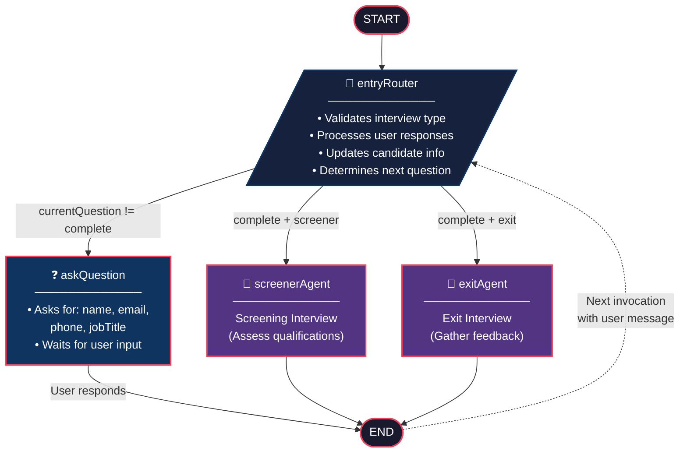
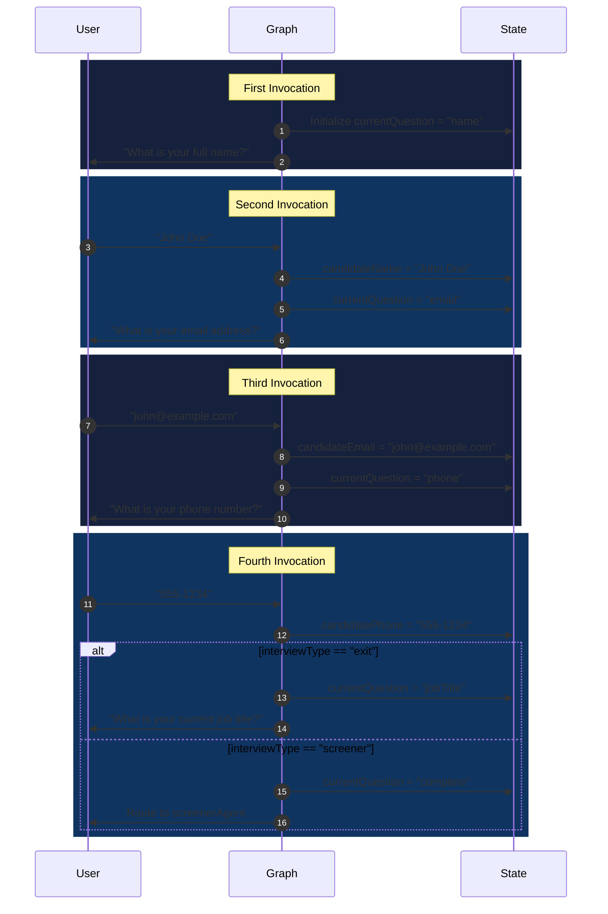
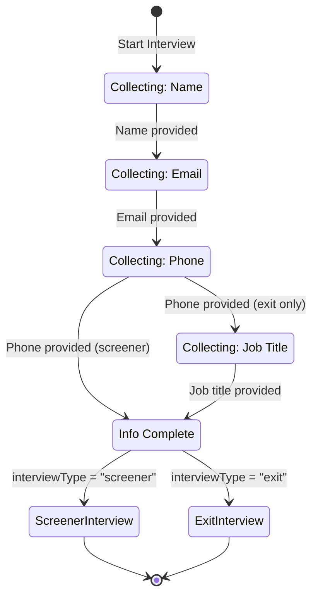

# Interview Orchestration Workflow

## Current Graph Structure

```mermaid
flowchart TD
    %% Styling
    classDef startEnd fill:#1a1a2e,stroke:#e94560,stroke-width:2px,color:#fff
    classDef router fill:#16213e,stroke:#0f3460,stroke-width:2px,color:#fff
    classDef question fill:#0f3460,stroke:#e94560,stroke-width:2px,color:#fff
    classDef agent fill:#533483,stroke:#e94560,stroke-width:2px,color:#fff
    classDef decision fill:#e94560,stroke:#fff,stroke-width:2px,color:#fff

    %% Nodes
    START([START]):::startEnd
    END_NODE([END]):::startEnd
    
    entryRouter[/"🔀 entryRouter
    ─────────────
    • Validates interview type
    • Processes user responses
    • Updates candidate info
    • Determines next question"/]:::router
    
    askQuestion["❓ askQuestion
    ─────────────
    • Asks for: name, email,
      phone, jobTitle
    • Waits for user input"]:::question
    
    screenerAgent["👤 screenerAgent
    ─────────────
    Screening Interview
    (Assess qualifications)"]:::agent
    
    exitAgent["👋 exitAgent
    ─────────────
    Exit Interview
    (Gather feedback)"]:::agent

    %% Flow
    START --> entryRouter
    
    entryRouter -->|"currentQuestion != complete"| askQuestion
    entryRouter -->|"complete + screener"| screenerAgent
    entryRouter -->|"complete + exit"| exitAgent
    
    askQuestion -->|"User responds"| END_NODE
    screenerAgent --> END_NODE
    exitAgent --> END_NODE
    
    %% Loop annotation
    END_NODE -.->|"Next invocation
    with user message"| entryRouter
```

## Info Collection Sequence

```mermaid
sequenceDiagram
    autonumber
    participant U as User
    participant G as Graph
    participant S as State

    rect rgb(22, 33, 62)
        Note over G: First Invocation
        G->>S: Initialize currentQuestion = "name"
        G->>U: "What is your full name?"
    end

    rect rgb(15, 52, 96)
        Note over G: Second Invocation
        U->>G: "John Doe"
        G->>S: candidateName = "John Doe"
        G->>S: currentQuestion = "email"
        G->>U: "What is your email address?"
    end

    rect rgb(22, 33, 62)
        Note over G: Third Invocation
        U->>G: "john@example.com"
        G->>S: candidateEmail = "john@example.com"
        G->>S: currentQuestion = "phone"
        G->>U: "What is your phone number?"
    end

    rect rgb(15, 52, 96)
        Note over G: Fourth Invocation
        U->>G: "555-1234"
        G->>S: candidatePhone = "555-1234"
        alt interviewType == "exit"
            G->>S: currentQuestion = "jobTitle"
            G->>U: "What is your current job title?"
        else interviewType == "screener"
            G->>S: currentQuestion = "complete"
            G->>U: Route to screenerAgent
        end
    end
```

## State Machine View

```mermaid
stateDiagram-v2
    [*] --> name: Start Interview
    
    name --> email: Name provided
    email --> phone: Email provided
    phone --> jobTitle: Phone provided (exit only)
    phone --> complete: Phone provided (screener)
    jobTitle --> complete: Job title provided
    
    complete --> ScreenerInterview: interviewType = "screener"
    complete --> ExitInterview: interviewType = "exit"
    
    ScreenerInterview --> [*]
    ExitInterview --> [*]

    state "Collecting: Name" as name
    state "Collecting: Email" as email  
    state "Collecting: Phone" as phone
    state "Collecting: Job Title" as jobTitle
    state "Info Complete" as complete
```

## Interview Types Comparison

```mermaid
flowchart LR
    subgraph screener["🎯 Screener Interview"]
        direction TB
        S1[Name] --> S2[Email] --> S3[Phone] --> S4[Begin Screening]
    end
    
    subgraph exit["👋 Exit Interview"]
        direction TB
        E1[Name] --> E2[Email] --> E3[Phone] --> E4[Job Title] --> E5[Begin Exit Interview]
    end
    
    style screener fill:#1a1a2e,stroke:#00d9ff,stroke-width:2px
    style exit fill:#1a1a2e,stroke:#e94560,stroke-width:2px
```

---

## Future Expansion Ideas

```mermaid
flowchart TD
    subgraph future["🚀 Potential Future Nodes"]
        direction TB
        
        LLM["🤖 LLM Integration
        ─────────────
        • OpenAI / Anthropic
        • Question generation
        • Response analysis"]
        
        Validation["✅ Input Validation
        ─────────────
        • Email format
        • Phone format
        • Required fields"]
        
        Memory["💾 Memory/RAG
        ─────────────
        • Previous interviews
        • Company context
        • Role requirements"]
        
        Summary["📊 Summary Generator
        ─────────────
        • Interview notes
        • Recommendations
        • Follow-up actions"]
    end
    
    style future fill:#0d1b2a,stroke:#778da9,stroke-width:2px
```

